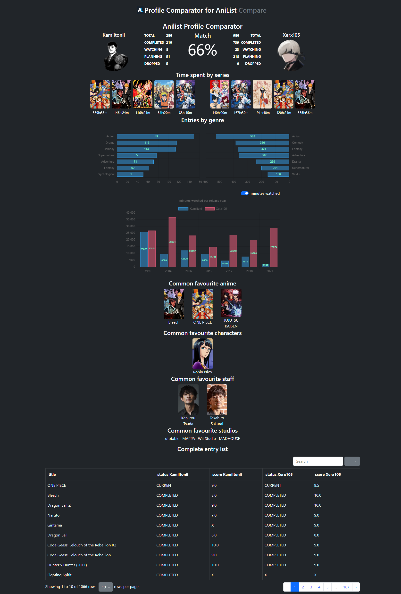

# AniProfile Comparator

## [Live Version](http://aniprofile-comparator.herokuapp.com/)

AniProfile Comparator is a Python Flask project that uses the Anilist API (GraphQL) to fetch user's anime statistics  
and retrieve meaningful insights from the data using pandas. This project allows you to quickly compare user  
statistics in a user friendly manner by providing side by side comparisons using charts and tables.

  
Preview

  

  
  

## Features:
- Table showcasing status completion and score comparison between user entries
- Displays the following statistics:
    - List overlap (Match %)
    - Highest time spent on watching anime by series
    - Genre distribution of watched series
    - Amount of list entries by completion status
    - Amount of list entries and minutes watched by release year of the series
    (in the 5 most relevant years per user)
    - Common favorite shows, characters, staff, and studios between users

## Technologies Used
- Python
- Flask
- Anilist API (GraphQL)
- Pandas
- NumPy
- Bootstrap
- charts.js

## Test cases
If you're unfamiliar with anilist and you still want to test my project you can try it out by inserting one of the nicknames listed below:  
Kamiltonii Xerx105 Teijy AmaiHachimitsu Cornier RenZed xBeni Leoxen   
If you want to use random user, you can try to navigate to https://anilist.co/user/X
and replace x with a random number to find a new username to work with.